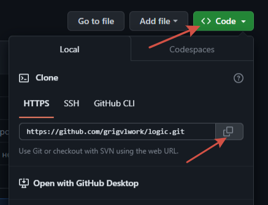

# Logic

## Продвинутый блокнот для супертренеров

   

### 0. Возможности:

Удобный вид ответа тренера, автоматический расчёт результатов выполнения программ, форматирование верного решения с 
помощью Black, просмотр программ с номерами строк, формирование текста ответа с тегами.
   
### 1. Как работать? 

Запустить main.py. Дальше вставляем ответ тренера в окно "Ответ тренера" и нажимаем "Обработка", происходит копирование 
текста по тегам в соответствующие окошки, программы запускаются, вносим правки, при этом, текст правок автоматически 
вносится в окно "Мой ответ", нажимаем кнопку "Копировать мой ответ" и вставляем в Янг. При проблемах с тегами у тренера 
просто заполняем нужные поля и формируем ответ, для перехода к следующему, нажимаем "Очистить".

### 2. Как установить?

В Pycharm всё достаточно просто: при создании проекта жмём кнопку "Get from VCS",

   
   
Копируем ссылку из Github

   

Вставляем в окошко создания проекта и нажимаем "Clone"

   

Обычно этого хватает, какое-то время понадобится чтобы закачались библиотеки и проиндексировались файлы.
Иногда бывает что автоматически не получается,

   

Тогда делаем так:

Настраиваем интерпретатор Python.

   

   

Лучше ставить виртуальное окружение (Virtual environment).
Потом устанавливаем зависимости
   
   

Жмём "Install"

   

Дожидаемся окончания установки и индексации. Готово.

