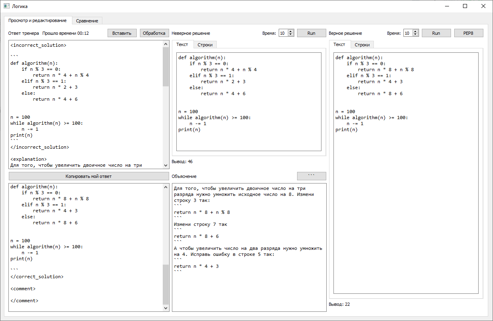
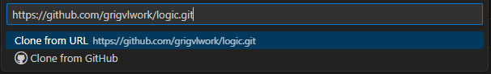
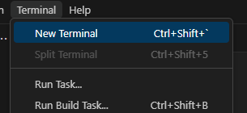

# Logic

## Продвинутый блокнот для супертренеров

   

### 0. Возможности:

Удобный вид ответа тренера, автоматический расчёт результатов выполнения программ, контроль по таймауту, форматирование 
верного решения с помощью **[Black](https://300.ya.ru/QwyIgWnG)**, просмотр программ с номерами строк, формирование 
текста ответа с тегами.
   
### 1. Как работать? 

Запустить main.py. Копируем в Янге ответ тренера со всеми тегами, переходим к окну программы, нажимаем "Вставить", ответ 
тренера вставляется в окно "Ответ тренера" начинается обработка, происходит копирование текста по тегам в 
соответствующие окошки, программы запускаются, вносим правки, при этом, текст правок автоматически вносится в окно 
"Мой ответ", нажимаем кнопку "Копировать мой ответ" и вставляем в Янг. При проблемах с тегами у тренера просто заполняем 
нужные поля и формируем ответ, для перехода к следующему, в Янге копируем следующий ответ, переходим к окну программы 
нажимаем "Вставить". (Повторяем)

#### 1.1. Как работать тренеру?

Запустить, скопировать верное и неверное решение в соответствующие окна, проверить что работает (и ответы разные) 
кнопками Run, по желанию отформатировать PEP8 (однострочники могут форматироваться не очень красиво, поэтому применяем
осторожно), написать объяснение, скопировать ответ и вставить в Янг. 

### 2. Как установить?

В Pycharm всё достаточно просто: при создании проекта жмём кнопку "Get from VCS",

   
   
Копируем ссылку из Github

   

Вставляем в окошко создания проекта и нажимаем "Clone"

   

Обычно этого хватает, какое-то время понадобится чтобы закачались библиотеки и проиндексировались файлы.
Иногда бывает что автоматически не получается,

   

Тогда делаем так:

Настраиваем интерпретатор Python.

   

   

Лучше ставить виртуальное окружение (Virtual environment).
Потом устанавливаем зависимости
   
   

Жмём "Install"

   

Дожидаемся окончания установки и индексации. Готово.

### 3. Как обновить
   

### 4. Как установить в VS Code

**[Скринкаст](https://disk.yandex.ru/i/w5uRy3C1_K2nQg)** 

Копируем ссылку, открываем VS Code, нажимаем Clone Git Repository

   

Вставляем ссылку, нажимаем Enter

   

Выбираем папку без русских букв в пути, это важно, если не хотите править системные переменные

   

Открываем папку 

   

Открываем новый терминал

   

Создаём виртуальное окружение

```
python -m venv c:\temp\logic\venv
```
Имена папок нужно написать свои

   

Переходим в папку окружения и активируем его, кнопка Tab помогает набирать

   

Возвращаемся в папку logic, устанавливаем зависимости (не забываем про Tab)

```
pip install -r requirements.txt
```


   

Открываем main.py, запускаем, работаем

Если всё-таки установили в папку с русскими буквами в пути, нужно открыть переменные среды

   

   

   

И создать переменную с именем `QT_QPA_PLATFORM_PLUGIN_PATH` и значением пути, которое надо будет скопировать из проводника
последовательно открывая папки из виртуального окружения venv

   

после этого нужно перезапустить VS Code и должно заработать


